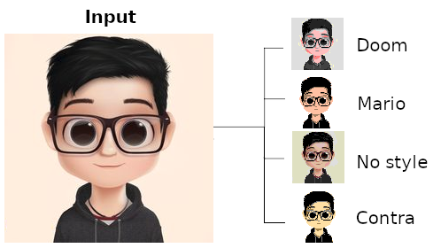

# Pixel Art Converter

Convert any image into classic retro pixel-art styles. Supports multiple 8-bit/16-bit inspired palettes and simple resize options.

<p align="center">
  
</p>

## Features
- Convert images to multiple retro styles like: Doom, Stardew, Contra, Mario
- Resize factor support for larger or smaller pixel art.
- CLI-friendly and easy to integrate into pipelines.

## Installation
```bash
git clone https://github.com/tejasashinde/pixel_art_generator.git
cd pixel_art_converter
pip install -r requirements.txt
```

## CLI Usage
```bash
usage: pixel_art_converter.cli [-h] -i INPUT -o OUTPUT [--style STYLE] [--resize RESIZE]

Convert an image to retro pixel-art style.

options:
  -h, --help                  Show this help message and exit
  -i INPUT, --input INPUT     Path to input image
  -o OUTPUT, --output OUTPUT  Path to output image (without style suffix)
  --style STYLE               Pixel art style. Available: ['doom', 'stardew', 'mario', 'zelda', 'contra']
  --resize RESIZE             Resize factor (default 4)
```

## Examples
Basic Usage
```bash
python -m pixel_art_converter.cli -i examples/input.png -o output.png
```
Apply Style (optional)
```bash
python -m pixel_art_converter.cli -i examples/input.png -o output.png --style doom # Doom
python -m pixel_art_converter.cli -i examples/input.png -o output.png --style mario # Mario
python -m pixel_art_converter.cli -i examples/input.png -o output.png --style zelda # Zelda
python -m pixel_art_converter.cli -i examples/input.png -o output.png --style stardew # Stardew
```
Resize/pixelation factor (optional)
```bash
python -m pixel_art_converter.cli -i examples/input.png -o output.png --style stardew --resize 3
```
