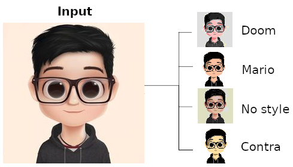

# Pixel Art Converter

Convert any image into classic retro pixel-art styles. Supports multiple 8-bit/16-bit inspired palettes and simple resize options.

<p align="center">
  
</p>

## Features
- Convert images to multiple retro styles like: Doom, Stardew, Contra, Mario, Zelda
- Includes 50 game-inspired palettes like: Pokemon GB, Metroid, Sonic, Chrono Trigger, Castlevania, Earthbound, Mega Man, Kirby, Final Fantasy, Super Mario World, Super Metroid, F-Zero, Star Fox
- Supports `none`, `ordered`, and `floyd-steinberg` dithering modes
- Preserves transparency when the source image has an alpha channel
- Can list and preview palettes from the CLI
- Keeps the output image at the same pixel dimensions as the input by default
- Resize factor support for larger or smaller pixel art.
- CLI-friendly and easy to integrate into pipelines.

## Installation
```bash
git clone https://github.com/tejasashinde/pixel_art_generator.git
cd pixel_art_converter
pip install -r requirements.txt
```

## CLI Usage
```bash
usage: pixel_art_converter.cli [-h] -i INPUT -o OUTPUT [--style STYLE] [--resize RESIZE]
                                [--dither {none,ordered,floyd-steinberg}]
                                [--list-styles] [--preview-palettes PREVIEW]

Convert an image to retro pixel-art style.

options:
  -h, --help                  Show this help message and exit
  -i INPUT, --input INPUT     Path to input image
  -o OUTPUT, --output OUTPUT  Path to output image (without style suffix)
  --style STYLE               Pixel art style. Available: run `--list-styles` for the full list
  --resize RESIZE             Resize factor (default 4)
  --dither {none,ordered,floyd-steinberg}
                              Dithering mode (default none)
  --list-styles               List all available palette styles and exit
  --preview-palettes PREVIEW  Generate a palette preview image and exit
```

## Examples
Basic Usage
```bash
python -m pixel_art_converter.cli -i examples/input.png -o output.png
```
Apply Style (optional)
```bash
python -m pixel_art_converter.cli -i examples/input.png -o output.png --style doom # Doom
python -m pixel_art_converter.cli -i examples/input.png -o output.png --style mario # Mario
python -m pixel_art_converter.cli -i examples/input.png -o output.png --style zelda # Zelda
python -m pixel_art_converter.cli -i examples/input.png -o output.png --style stardew # Stardew
python -m pixel_art_converter.cli -i examples/input.png -o output.png --style mario --dither floyd-steinberg
```
Resize/pixelation factor (optional)
```bash
python -m pixel_art_converter.cli -i examples/input.png -o output.png --style stardew --resize 3
```

List palettes
```bash
python -m pixel_art_converter.cli --list-styles
```

Generate a palette preview
```bash
python -m pixel_art_converter.cli --preview-palettes palettes.png
```
